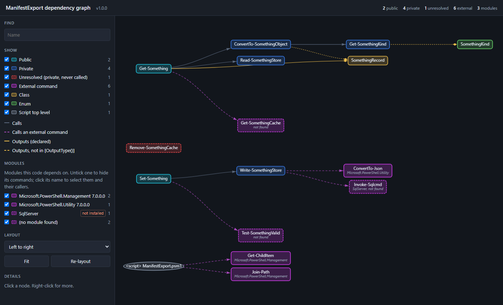

# PSModuleDependencyGraph

Builds a dependency graph of a PowerShell module or script: its public and private functions, classes and enums, what calls what, which commands come from other modules, and which modules those are. It works statically, through the AST. The module being graphed is never imported, dot-sourced, or executed.

Requires PowerShell 7.4 or later.

## Usage

From the root of a clone of this repository, paste this into PowerShell 7.4 or later. It graphs one of the example modules in `ModuleTests/`, which has `Public/` and `Private/` folders, a manifest, a class and an enum, and calls into other modules:

```powershell
Import-Module ./src/PSModuleDependencyGraph/PSModuleDependencyGraph.psd1

$graph = Get-PSModuleDependencyGraph -Path ./ModuleTests/StandardModule/ManifestExport

# Everything in the graph, and what type each thing is
$graph.Nodes | Format-Table Name, Type, CmdletBinding, @{ n = 'File'; e = { if ($_.Path) { Split-Path $_.Path -Leaf } } }

# Which of the module's own functions call which
$graph.Edges | Where-Object Kind -eq 'CommandReference' | Where-Object Resolution -ne 'External' |
    Format-Table SourceName, TargetName, Resolution
```

Output:

```text
Name                      Type       CmdletBinding File
----                      ----       ------------- ----
ConvertTo-SomethingObject Private            False ConvertTo-SomethingObject.ps1
Get-SomethingKind         Private            False ConvertTo-SomethingObject.ps1
Read-SomethingStore       Private            False Read-SomethingStore.ps1
Remove-SomethingCache     Unresolved         False Remove-SomethingCache.ps1
Write-SomethingStore      Private            False Write-SomethingStore.ps1
Get-Something             Public              True Get-Something.ps1
Set-Something             Public              True Set-Something.ps1
SomethingRecord           Class              False SomethingRecord.ps1
SomethingKind             Enum               False SomethingRecord.ps1
<script>                  Script             False ManifestExport.psm1
Get-ChildItem             External           False
Join-Path                 External           False
ConvertTo-Json            External           False
Invoke-Sqlcmd             External           False
Get-SomethingCache        External           False
Test-SomethingValid       External           False

SourceName                TargetName                Resolution
----------                ----------                ----------
ConvertTo-SomethingObject Get-SomethingKind         Unique
Get-Something             Read-SomethingStore       Unique
Get-Something             ConvertTo-SomethingObject Unique
Set-Something             Write-SomethingStore      Unique
```

To graph your own code, point `-Path` at a module folder, a `.psd1`, a `.psm1`, or a `.ps1` script. `-Name` takes an installed module's name. The other folders under `ModuleTests/` work the same way, for example `./ModuleTests/Script/SingleFile/Invoke-Report.ps1` or `./ModuleTests/StandardModule/NameCollision`.

## Types

Every node has a `Type`:

| Type | What it is |
|---|---|
| `Public` | A function the module exports. |
| `Private` | A function the module does not export, called by something in the module. |
| `Unresolved` | A private function nothing in the module calls: dead code, or something that should have been exported. `$graph.Unresolved` lists them. |
| `External` | A command the module calls but does not define, such as `Get-ChildItem`, with the module it comes from. |
| `Class`, `Enum` | A class or enum the module defines. |
| `Script` | Code at the top level of a file, such as a `.psm1` that dot-sources its folders. |

## Modules and external commands

Everything is worked out when the graph is built, so the graph alone says which modules the code depends on and which of their commands it uses:

```powershell
$graph.Modules | Format-Table Name, Version, IsInstalled, DeclaredBy, Commands, UsedBy
$graph.Nodes | Where-Object Type -eq 'External' | Format-Table Name, ModuleName, ModuleVersion, CommandType, IsFound, UsedBy
```

```text
Name                            Version IsInstalled DeclaredBy                        Commands                   UsedBy
----                            ------- ----------- ----------                        --------                   ------
Microsoft.PowerShell.Management 7.0.0.0        True {Command lookup}                  {Get-ChildItem, Join-Path} {<script>}
Microsoft.PowerShell.Utility    7.0.0.0        True {Command lookup}                  {ConvertTo-Json}           {Write-SomethingStore}
SqlServer                                     False {Module\Command, RequiredModules} {Invoke-Sqlcmd}            {Write-SomethingStore}

Name                ModuleName                      ModuleVersion CommandType IsFound UsedBy
----                ----------                      ------------- ----------- ------- ------
Get-ChildItem       Microsoft.PowerShell.Management 7.0.0.0       Cmdlet         True {<script>}
Join-Path           Microsoft.PowerShell.Management 7.0.0.0       Cmdlet         True {<script>}
ConvertTo-Json      Microsoft.PowerShell.Utility    7.0.0.0       Cmdlet         True {Write-SomethingStore}
Invoke-Sqlcmd       SqlServer                                                   False {Write-SomethingStore}
Get-SomethingCache                                                              False {Get-Something}
Test-SomethingValid                                                             False {Set-Something}
```

`DeclaredBy` says how each module was named:
- **Declared in the code:** `RequiredModules` in the manifest, `#Requires -Modules`, `using module`, `Import-Module` with a literal name, or a `Module\Command` call.
- **Found by lookup:** `Command lookup` means the module was found by looking the command up on this machine.

External commands are looked up with `Get-Command` in a separate runspace, using a wildcard form of each name. That form is answered from the module cache without importing anything, so graphing a module does not load the modules it depends on. A command nothing on this machine provides has `IsFound` set to `$false`. A `Module\Command` call keeps its module even when that module is not installed, as with `SqlServer` above.

## What each node carries

Every node has the same properties, whatever its kind, so they are safe to read under `Set-StrictMode`:

| Property | What it holds |
|---|---|
| `Name`, `Kind`, `Type`, `Path` | What it is, and its file. |
| `StartLine`, `EndLine` | Where the definition starts and ends. |
| `IsExported`, `ExportState`, `ExportSource` | Public or private, and how that was decided (see below). |
| `CmdletBinding` | Whether the function has `[CmdletBinding()]`. |
| `DependsOn` | Names of the module's own functions, classes and enums it calls, outputs or inherits from. |
| `UsedBy` | Names of what calls or uses it. |
| `ExternalCalls`, `ModulesUsed` | External commands it calls, and the modules they belong to. |
| `Parameters` | Name, type, aliases, default value, the `.PARAMETER` help text, and its settings in each parameter set. |
| `ParameterSets`, `DefaultParameterSet` | Each set's name, whether it is the default, and its parameters, as `Get-Command` reports them once the module is loaded. |
| `Help` | Comment-based help: `Synopsis`, `Description`, `Examples` (one entry per `.EXAMPLE`), `Parameters`, `Inputs`, `Outputs`, `Notes`, `Links`. |
| `OutputType` | Types the function names in `[OutputType()]`. |
| `InferredOutputType` | Types the function's body writes to the pipeline, found by PowerShell's own type inference. |
| `UndeclaredOutputType` | Inferred types missing from `[OutputType()]`. |
| `OutputBy`, `UndeclaredOutputBy` | On a class or enum: the functions that output it, and those that do so without declaring it. |
| `ModuleName`, `ModuleVersion`, `CommandType`, `IsFound` | On an external command: where it comes from. |

```powershell
$graph.Nodes | Where-Object Kind -in 'Class', 'Enum' | Format-Table Name, Type, OutputBy, UndeclaredOutputBy
```

```text
Name            Type  OutputBy                                   UndeclaredOutputBy
----            ----  --------                                   ------------------
SomethingRecord Class {ConvertTo-SomethingObject, Get-Something} {ConvertTo-SomethingObject}
SomethingKind   Enum  {Get-SomethingKind}                        {Get-SomethingKind}
```

### Using it in a build

Parameter sets, help and output types are on each node, so a build can check them without importing the module. For example: every public function should have at least one example per parameter set, no private function should be unresolved, and every output should be declared:

```powershell
$graph.Nodes | Where-Object IsExported |
    Where-Object { $_.Help.Examples.Count -lt $_.ParameterSets.Count } |
    ForEach-Object { "$($_.Name) has $($_.ParameterSets.Count) parameter sets but $($_.Help.Examples.Count) example(s)" }

$graph.Unresolved | Format-Table Name, StartLine, EndLine

$graph.Nodes | Where-Object { $_.UndeclaredOutputType } | Format-Table Name, OutputType, UndeclaredOutputType
```

```text
Set-Something has 2 parameter sets but 1 example(s)

Name                  StartLine EndLine
----                  --------- -------
Remove-SomethingCache         1       5

Name                      OutputType UndeclaredOutputType
----                      ---------- --------------------
ConvertTo-SomethingObject            {SomethingRecord}
Get-SomethingKind                    {SomethingKind}
Read-SomethingStore                  {System.String}
```

This repository's own tests run the first check against this module.

## Viewing the graph as HTML

The same module, drawn as an interactive page. Paste this from the root of the repository:

```powershell
Import-Module ./src/PSModuleDependencyGraph/PSModuleDependencyGraph.psd1

Get-PSModuleDependencyGraph -Path ./ModuleTests/StandardModule/ManifestExport |
    Save-PSModuleDependencyGraphHtml -Path ./ManifestExport.html
```

Or save it to `$env:TEMP\PSModuleDependencyGraph\ManifestExport.html` and open it in one step:

```powershell
# In your default browser
Get-PSModuleDependencyGraph -Path ./ModuleTests/StandardModule/ManifestExport -ShowInBrowser

# In VS Code, with the 'code' command
Get-PSModuleDependencyGraph -Path ./ModuleTests/StandardModule/ManifestExport -ShowInVSCode
```

VS Code has no built-in HTML preview, so `-ShowInVSCode` opens the page as source. A preview extension such as [Live Preview](https://marketplace.visualstudio.com/items?itemName=ms-vscode.live-server) renders it.



The page is one self-contained file, with no internet connection needed, so it can be attached to a ticket or mailed. Everything is laid out left to right, each caller before what it calls:

- **Colors by type:** **cyan** is public, **blue** private, **red dashed** unresolved, and **magenta** external, with the command's module written under its name. Classes are **amber** and enums **green**. An external command not found on this machine has a dashed border.
- **Show:** one box per type, with counts. Untick a type to hide it; click its name to select every node of that type.
- **Modules:** every module the code depends on, with its version and whether it is installed here. Untick a module to hide its commands; click its name to select its commands and the functions that call them.
- **Arrows:**
  - An **amber** arrow ending in a diamond means a function outputs a class or enum. It is solid when `[OutputType()]` declares it and dotted when it does not.
  - A **dashed amber** arrow is an ambiguous call: more than one function has that name (try `./ModuleTests/StandardModule/NameCollision`).
- **Click a node** to see its type, `CmdletBinding`, file and lines, synopsis, parameter sets, examples, declared and actual output types, module, what it calls, and what calls it.
- **Right-click a node** for **Show in VS Code**, which opens the file at the definition's first line, and to copy its path, name or module.

### Changing how it looks

Colors, spacing, which types show when the page opens, and the right-click menu come from [`GraphHtmlConfig.psd1`](src/PSModuleDependencyGraph/Resources/GraphHtmlConfig.psd1). To change them, write a `.psd1` with only the keys you want and pass it with `-ConfigPath`:

```powershell
# MyColours.psd1
@{
    Theme      = @{ Background = '#000000' }
    NodeGroups = @( @{ Name = 'private'; Color = '#8ab4f8' } )
    Layout     = @{ Direction = 'TopToBottom'; TopToBottom = @{ NodeSpacing = 220 } }
    Show       = @{ Types = @('public', 'private', 'unresolved') }
}
```

```powershell
Get-PSModuleDependencyGraph -Path ./ModuleTests/StandardModule/ManifestExport |
    Save-PSModuleDependencyGraphHtml -Path ./ManifestExport.html -ConfigPath ./MyColours.psd1
```

Your file is merged over the defaults: hashtables key by key, `NodeGroups` by `Name`, and other lists replaced whole.

- **Right-click menu:** it's a list, `NodeMenu`, so adding an entry adds a menu item. Each entry opens a link or copies text built from placeholders such as `{fullPath}`, `{startLine}` and `{module}`.
- **Other kinds of graph:** each node's type decides its group, and the config decides how each group looks, so the same page can draw other kinds of graph.
- **Sharing a saved page:** for the right-click menu to open files, the page holds the module's full folder path. Keep that in mind before sharing it.

## How a function is decided to be exported

`ExportSource` on each function says which rule applied:

| ExportSource         | When                                                                                      |
|----------------------|-------------------------------------------------------------------------------------------|
| `Manifest`           | The manifest has `FunctionsToExport` (wildcards honoured).                                |
| `ExportModuleMember` | `Export-ModuleMember -Function` with literal names.                                       |
| `ImplicitAll`        | A `.psm1` with no `Export-ModuleMember`: every function is exported, as PowerShell does.   |
| `FolderConvention`   | `Export-ModuleMember` is given a computed value (e.g. `$public.BaseName`); functions under a `Public` folder count as exported. |
| `NotApplicable`      | A plain `.ps1` script.                                                                    |
| `Unknown`            | None of the above could be established.                                                   |

Pointing `-Path` at a single `.ps1` or `.psm1` with no sibling manifest graphs only that file.

## Supported layouts

`ModuleTests/` holds one example of each, and `tests/` asserts the graph for each:

- `Script/` - a single `.ps1` with functions.
- `ScriptModule/` - a single `.psm1`: implicit export, `Export-ModuleMember`, manifest list, manifest wildcard.
- `StandardModule/` - `Public/` and `Private/` folders: manifest export, dynamic export, a `[public]Get-Something` / `[private]Get-Something` name collision, nested folders.

## Tests

`requirements.psd1` declares Pester 6.1.0 or later and InvokeBuild 5.14.23. The build script installs [ModuleFast](https://github.com/JustinGrote/ModuleFast) if it is missing, uses it to install what `requirements.psd1` declares, and then runs the tests with InvokeBuild. Nothing needs installing first:

```powershell
./module.build.ps1
```

Once InvokeBuild 5.14.23 is installed, `Invoke-Build` works too.

## Credits

The HTML view is inspired by [PSWriteHTML](https://github.com/EvotecIT/PSWriteHTML) by [Przemysław Kłys](https://github.com/PrzemyslawKlys) of [Evotec](https://evotec.xyz). Its `New-HTMLDiagram` showed the approach used here: hand [vis-network](https://visjs.github.io/vis-network/) a list of nodes, a list of edges and a set of layout options, and let the browser draw it. This module does not use PSWriteHTML's code; it builds the page itself so that it runs on PowerShell 7.4 and later.

vis-network 10.1.2 is included in `src/PSModuleDependencyGraph/Resources/` and embedded in each saved page. It is dual-licensed under the Apache 2.0 and MIT licenses; both license files are next to it.
